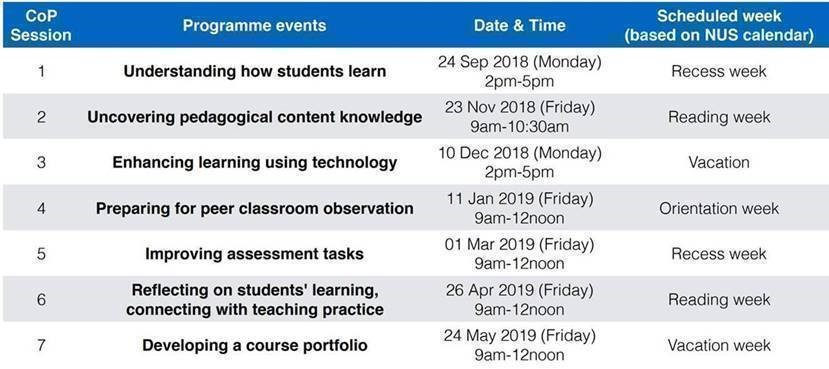
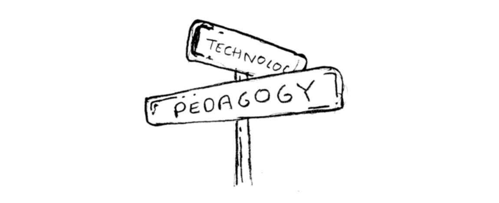
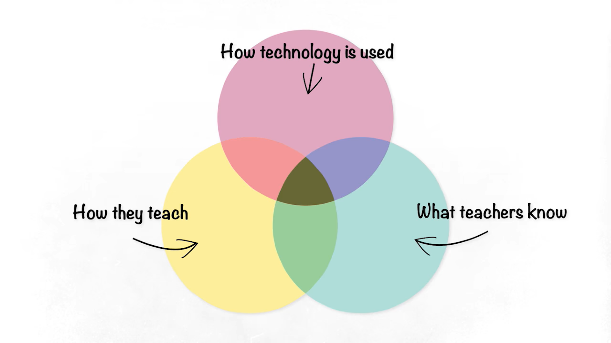
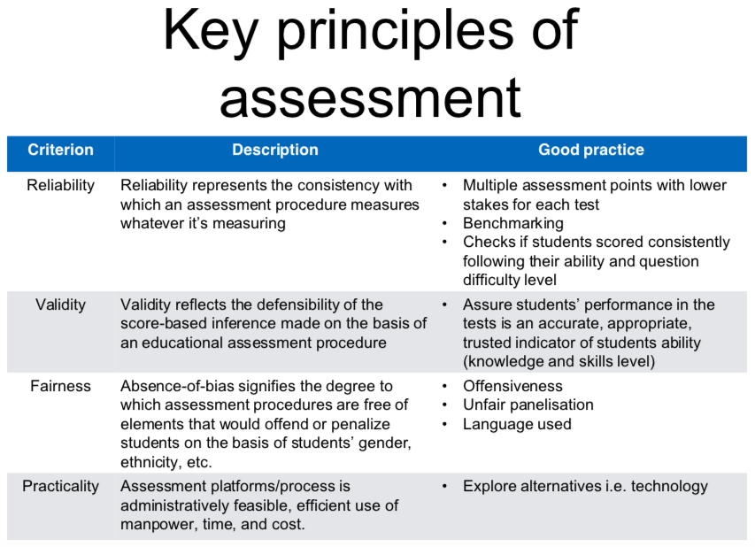

**[Professional Development Programme - Teaching (PDP-T)](http://www.cdtl.nus.edu.sg/pdp/ "PDP-T")** 

PDP-T aims to provide a collegial environment for early career academics to explore and reflect critically on their teaching practice with the aim of improving the quality of their students' learning.

**[Centre for Development of Teaching & Learning (CDTL)](http://www.cdtl.nus.edu.sg/ "CDTL")** 

**[National University of Singapore (NUS)](http://nus.edu.sg/ "NUS")** 

---

**PDP-T Participant: [GU Zhan (Sam)](https://www.iss.nus.edu.sg/about-us/staff/detail/201/GU%20Zhan "GU Zhan (Sam)")**

**zhan.gu@nus.edu.sg**

**Table of Contents**

[TOCM]

[TOC]

## My Teaching Philosophy
`"Teach people, not content."`

## My Teaching Framework
`Andragogy: methods and practices of teaching adult learners; adult education`

## My Teaching Enabler
`Blended learning: blend classroom with work and technology`

# My Course/Teaching Portfolio
[ PDP-T Submission ]

## Part 1: Teaching Philosopy
> **A reflective 'teaching statement' describing your personal teaching philosopy, strategies, and objectives**

### Part 1.1 Core beliefs about teaching and learning
* What are your beliefs about teaching and your role as a teacher? 
* How do this belief develop or change in your journey as a teacher?
* What are your beliefs about learning in the context of your discipline?

### Part 1.2 Goals for student learning
* What are you preparing students for (i.e. knowledge, skills, values, and attitudes)?
* What are your beliefs about how student learning in your field occurs?

### Part 1.3 Strategies/methods to enact the goals
* How do you implement these ideas about teaching and learning in the 
classroom?

### Part 1.4 Assessment of influence/impact 
* How do you know students are learning what you want them to learn through your teaching methods/strategies? 

## Part 2: Reflective Case Narratives
> **Approaches to teaching and learning**

E.g. 1 or 2 reflective case narratives on a critical incident or teaching episode which
* Provides an illustration of how you teach; or
* Discuss a critical incident or teaching episode sharing growth as a teacher

### Part 2.1
* Why did you choose the particular approach to teaching?

### Part 2.2
* What are some valuable sources of information about your teaching on students learning (peer observations, student outcomes, examples of student work, relevant course material, mid-semester feedback, etc.)?

### Part 2.3
* How do you plan to continue to improve your future teaching practice?

## Part 3: Appendices
> **Include one or more of the following to provide evidence for your teaching philosophy and case narratives.**

* TPI and ATI reports
* Relevant blogs to support narratives
* Peer observation forms (completed forms for pre/in/post)
* Selected survey feedback from students
* Selected student work
* Any other relevant evidence

---

# My PDP-T Learning Journey

## Session 1: September 2018 09 24 (Monday) Understand How Students Learn

### Importance of Prior Knowledge

In their book **"How Learning Works: Seven Research-Based Principles for Smarter Teaching"**, Ambrose, Bridges, Lovett and others (2010) discuss how faculty can gauge the extent and nature of students' prior knowledge.  These strategies include;

1. Talk to your colleagues. Consider talking to your colleagues who teach prerequisite courses that students are expected to complete. You may ask them about the contents that was covered, the type of assignments completed, the assignments students struggled to complete and why, the areas or topics students enjoyed, and so on.  For online instructors, one may consider reviewing the prior online course or the syllabus for the course for information such as list of textbooks, reading materials used, etc. The information gathered should help you know the content that was covered and the depth of coverage, as well as skills that were mastered. This information would help as you design instructional activities for your course.

2. Use low-stake assignment or quiz. To find out what prior knowledge students bring to your class you may consider giving a low-stake assignment or a quiz early in the semester.  Student's performance on this kind of assessment will be a good indicator of the skills and knowledge they already possess.  Such assessments may include having students write an essay, take a multiple choice quiz, or complete a short answer quiz that examines students understanding of concepts and definition of terminologies that students are expected know.

3. Self-assessment of prior knowledge.  Another efficient strategy for assessing students’ prior knowledge is to provide them with the opportunity to assess their own knowledge and skills. Such self-assessments should be low-stake and anonymous to encourage candid responses. The intention is to gain an overall idea of the range of skills and knowledge of your student and not to judge individual student's performance.  Questions could focus on the prerequisite skills, knowledge and experiences expected of your students as well as the skills and knowledge that student will be expected to leave the course with. Students could be asked to rate themselves on a scale with items such as; 1= I have heard of the term, 2 = I can define the term, 3 = I can explain the term to a colleague, 4= I can use the term to solve a problem. Students' responses should assist the instructor to plan appropriate instructional activities that could enhance students learning.

### References

- [Importance of Prior Knowledge to Learning](https://news.illinoisstate.edu/2012/01/importance-of-prior-knowledge-to-learning/)

## Session 2: November 2018 11 27 (Wednesday) Uncovering Pedagogical Content Knowledge

### Why Pedagogical Content Knowledge?

Anne had a chemistry teacher her sophomore year of high school who had an impressive background working in the field. She knew the subject matter perfectly, so most people would assume that her knowledge made her a great teacher. After all, the most important thing is for the teacher to know what they teach inside and out, right? Well, yes... and no. Anne learned through her experience with Mrs. Johnson that she needed more than a teacher who knew her subject well. She needed one who also knew how to teach it well. So, while Anne's teacher knew chemistry like the back of her hand, she didn't seem to know how to explain it, illustrate it, and make it understandable to Anne and her classmates. For someone who wasn't the greatest with formulas and science to begin with, Anne really needed more assistance.

As it turned out, Anne wasn't the only student who needed more from her teacher. In 1986, Lee Shulman, an educator and researcher, noticed that all students need a teacher who is more than knowledgeable about their subjects. They also need one who can teach their specific subjects clearly and effectively. He called this combination of content and teaching knowledge, pedagogical content knowledge.

So, back to our first scenario with Mrs. Johnson. If she had combined her knowledge of chemistry with class exercises, creative examples, and careful explanations, she would have displayed pedagogical content knowledge. She also would have been a more successful teacher.

**Pedagogical content knowledge (PCK)** was introduced by Shulman in 1986 and refers to the knowledge teachers use to translate particular subject matter to students, taking into account possible (mis)conceptions, relationship between knowledge of teaching materials, how to transfer the subject matter, and leveraging students' prior knowledge.

### References

- [Pedagogical Content Knowledge: Definition & Explanation](https://study.com/academy/lesson/pedagogical-content-knowledge-definition-lesson-quiz.html)

## Session 3: December 2018 12 10 (Monday) Enhancing Learning Using Technology

#### Framework 1: SAMR - Intersection of Technology & Pedagogy

Popularized by Dr. Ruben R. Puentedura, SAMR is a model for infusing technology into the learning experiences. It enables multimedia content creation and communication with the world community. It has four layers: 

* Redefiniton `Transforming the learning task (higher) layer`
* Modification `Transforming the learning task (higher) layer`
* Augmentation `Enhancing the learning task (lower) layer`
* Substituion `Enhancing the learning task (lower) layer`

#### Framework 2: TPACK - Technological Pedagogical Content Knowledge

TPACK, or Technological Pedagogical Content Knowledge, is a model that helps teachers consider where their strengths and weaknesses lie in their knowledge of content, pedagogy, and technology and how these areas work together for innovative teaching and learning.

### References

- [What is the SAMR Model and what does it look like in schools?](https://www.youtube.com/watch?v=SC5ARwUkVQg)

 
 
- [What is the TPACK Model?](https://www.youtube.com/watch?v=yMQiHJsePOM)

 

## Session 4: January 2019 02 23 (Saturday) Preparing for Peer Classroom Observation

### Purpose of Peer Observation
The peer observation component will provide you with feedback on your teaching. It consists of a structured formative peer review of your teaching, including a class visit as well as pre- and post-observation discussions with your peers. The ultimate aim is to enable ongoing improvement of early career academics (ECA) teaching and learning practices under supportive conditions.

This document serves as a guide for participating in the peer observation component. 

### Intended Learning Outcomes
By the end of this component, you should be able to:

* articulate your beliefs and actions that frame your daily teaching practice;
* apply to your teaching what you have learnt in PDP-T Core; and,
* review your teaching on the basis of feedback from peers to improve your future practice.

### Strategy to conduct Peer Observation
Peer partnership is the strategy adopted in the peer observation segment of the PDP-T programme. Peer partnership is a reciprocal process in which an academic staff observes a partner’s teaching and learning process and then provides supportive and constructive feedback (Bell, 2005).  The main idea is that peers will learn from each other as they take turns to observe each other’s teaching practice. The old adage that “to teach is to learn twice over”  holds true and many advantages arise from the use of peer partnership. Some of these benefits include:

* sharing of good practice;
* promoting critical reflection of teaching practices;
* learning and engagement in innovation of teaching and learning environments; and, 
* promoting scholarship of teaching as it encourages teaching skills and knowledge to be shared. 

To carry out the peer observation process, two colleagues are to agree to act as the observer (person conducting the observation) and the observee (person to be observed). The observation takes place followed by a reversal of the roles later. In addition, participants are to recognise that the insights gained and comments shared are to be kept between the observer and observee, unless otherwise discussed when setting up their personal observation protocol.

### References

- Bell, M. (2005). Peer observation partnerships in higher education. Milperra, NSW: HERDSA.
- Joubert, J. (1899). A selection from his thoughts. From chapter XVIII, Of Education.

## Session 5: March 2019 03 08 (Friday) Improving Assessment Tasks

### Improving Learning through Assessment

Factors associated with improving learning through assessment are: 

1. The provision of effective feedback to students 

2. The active involvement of students in their own learning 

3. Adjusting teaching to take account of the results of assessment 

4. A recognition of the profound influence assessment has on the motivation and self-esteem of students, both of which are crucial influences on learning 

5. The need for students to be able to assess themselves and understand how to improve 


### References

- Black, P, and D. Wiliam (1998) Assessment and Classroom Learning, Education: Principles, Policy and Practice, 5(1), 7–74. 

## Session 6: April 2019 04 26 (Friday) Reflecting on Students' Learning, Connecting with Teaching Practice

### Work in Progress...

### References

## Session 7: May 2019 05 30 (Thursday) Developing A Course Portfolio

### Summary of Five Perspectives on 'Good Teaching'

Each of the paragraphs below represents a different perspective on 'good teaching'.
Together, they will help you understand and interpret your profile. Keep in mind that these five are not mutually exclusive perspectives. In our research involving hundreds of teachers, the vast majority hold one or two dominant perspectives. Many hold an additional 'back-up' perspective that is high, although not dominant. This combination of dominant and back-up perspectives allows teachers to accommodate changes in context, content, and learners. Common sense requires that no one can operate from all five simultaneously, since they represent contrasting and sometimes competing views of teaching.

** 1. Transmission**: Effective teaching requires a substantial commitment to the content or subject matter.

**  2. Apprenticeship**: Effective teaching is a process of socializing students into new behavioral norms and ways of working.

**  3. Developmental**: Effective teaching must be planned and conducted "from the learner's point of view".

**  4. Nurturing**: Effective teaching assumes that long- term, hard, persistent effort to achieve comes from the heart, not the head.

**  5. Social Reform**: Effective teaching seeks to change society in substantive ways.

### References

- [TPI - Teaching Perspectives Inventory Summaries](http://www.teachingperspectives.com/tpi_html/tpi_summaries.htm)

---
# Institute  for  Adult  Learning  (IAL)  - Adult Education Professionalisation (AEP)

## Topic 1: Apply Adult Learning Principles in Training
> **This section discusses application of adult learning principles in training delivery.**

### Malcolm Knowles' andrology theory
This theory can be stated with six assumptions related to the motivation of adult learning:

- **Need to know**: Adults need to know the reason for learning something.
- **Foundation**: Experience (including error) provides the basis for learning activities.
- **Self-concept**: Adults need to be responsible for their decisions on education; involvement in the planning and evaluation of their instruction.
- **Readiness**: Adults are most interested in learning subjects having immediate relevance to their work and/or personal lives.
- **Orientation**: Adult learning is problem-centered rather than content-oriented.
- **Motivation**: Adults respond better to internal versus external motivators.

## Topic 2: Design a Learning Experience
> **This section discusses designing lesson plans for a short learning experience applying the understanding of adult learning principles, active learning qualities and instructional methods.**

## Topic 3: Prepare and Facilitate a Learning Experience
> **This section discusses preparing and facilitating an active learning experience for learners.**

## Topic 4: Interpret the Singapore Workforce Skills Qualifications System
> **This section interprets the Singapore Workforce Skills Qualifications System and a set of National Competency Standards and apply them in a learning and development context.**

## Topic 5: Assess Competence
> **This section discusses preparing and conducting a competency-based assessment to assess competence.**

## Topic 6: Prepare for Continuing Professional Development
> **This section discusses objective reflection upon his or her own training/teaching practice to engage in continuing professional development for improvement.**

# References

- [The Adult Learning Theory - Andragogy - of Malcolm Knowles](http://web.cortland.edu/frieda/id/IDtheories/42.html?utm_campaign=elearningindustry.com&utm_source=%2Fthe-adult-learning-theory-andragogy-of-malcolm-knowles&utm_medium=link)
- [Blending Classroom With Work And Technology](https://www.ial.edu.sg/find-resources/learning-resources-and-tools/blend-classroom.html)

---

